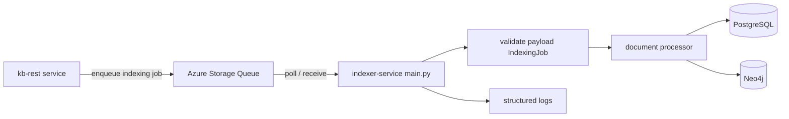

# Indexer Service

Background worker for knowledge-base indexing jobs.

This service runs as a long-lived process, polls an Azure Storage Queue, validates each job payload, and calls the document processing pipeline.

## What It Does

- Polls queue: `INDEXING_QUEUE_NAME` (default: `kb-indexing-jobs`)
- Reads JSON messages and validates them with Pydantic (`IndexingJob`)
- Initializes PostgreSQL and Neo4j connections on startup
- Processes jobs concurrently (`MAX_CONCURRENT_JOBS`)
- Deletes queue message only on successful processing
- Leaves failed messages for retry (Azure Queue retry + poison queue behavior)

## Current Status

The queue worker is implemented and running.
The deep document ingestion pipeline in `src/workers/document_processor.py` is currently a stub and marked TODO (planned port from `ingestion_new.py`).

## Architecture



## Project Layout

```text
indexer-service/
  main.py                         # Async queue worker entrypoint
  .env.example                    # Environment variable template
  requirements.txt                # Runtime dependencies
  pyproject.toml                  # Project metadata + tooling config
  src/
    core/
      config.py                   # Settings and env binding
      database.py                 # PostgreSQL + Neo4j connection manager
      logging.py                  # Structured logging helpers
    shared/
      models.py                   # Queue/job/result Pydantic models
    workers/
      document_processor.py       # Document ingestion (stub/TODO)
  tests/
    test_config.py
    test_models.py
```

## Prerequisites

- Python 3.11+
- Access to an Azure Storage Queue or Azurite for local development
- PostgreSQL reachable from the service
- Neo4j reachable from the service

Optional for full ingestion use-cases:
- Azure Document Intelligence
- Azure OpenAI

## Setup

### 1. Create and activate virtual environment

Windows PowerShell:

```powershell
cd indexer-service
python -m venv .venv
.\.venv\Scripts\Activate.ps1
```

macOS/Linux:

```bash
cd indexer-service
python -m venv .venv
source .venv/bin/activate
```

### 2. Install dependencies

```bash
pip install -r requirements.txt
```

If your environment supports PEP 621 editable installs:

```bash
pip install -e .
```

### 3. Configure environment

```bash
cp .env.example .env
```

On Windows PowerShell, use:

```powershell
Copy-Item .env.example .env
```

Then update `.env` values.

## Environment Variables

### Required (minimum to start worker)

| Variable | Description | Example |
|---|---|---|
| `AZURE_STORAGE_CONNECTION_STRING` | Queue storage connection | `UseDevelopmentStorage=true` |
| `INDEXING_QUEUE_NAME` | Queue name to poll | `kb-indexing-jobs` |
| `POSTGRESQL_DATABASE_HOST` | PostgreSQL host | `localhost` |
| `POSTGRESQL_DATABASE_PORT` | PostgreSQL port | `5432` |
| `POSTGRESQL_DATABASE_USER` | PostgreSQL user | `postgres` |
| `POSTGRESQL_DATABASE_PASSWORD` | PostgreSQL password | `***` |
| `POSTGRESQL_DATABASE_DATABASE` | PostgreSQL database name | `kbcurator` |
| `NEO4J_DATABASE_NEO4J_BOLT_URI` | Neo4j bolt URI | `bolt://localhost:7687` |
| `NEO4J_DATABASE_NEO4J_USER` | Neo4j user | `neo4j` |
| `NEO4J_DATABASE_NEO4J_PASSWORD` | Neo4j password | `***` |

### Worker tuning

| Variable | Default | Meaning |
|---|---:|---|
| `MAX_CONCURRENT_JOBS` | `10` | Max messages processed concurrently |
| `MESSAGE_VISIBILITY_TIMEOUT` | `300` | Seconds message stays invisible while processing |
| `QUEUE_POLL_INTERVAL` | `5` | Seconds between poll cycles when queue is empty |
| `LOG_LEVEL` | `INFO` | `DEBUG`, `INFO`, `WARNING`, `ERROR`, `CRITICAL` |
| `ENVIRONMENT` | `development` | `development`, `staging`, `production` |

### Optional integrations

- `OCR_PROVIDER` (`azure`, `aws`, `gcp`, or `none`; default: `azure`)
- `AZURE_DOC_INTELLIGENCE_ENDPOINT`
- `AZURE_DOC_INTELLIGENCE_KEY`
- `AWS_TEXTRACT_REGION`
- `AWS_TEXTRACT_ACCESS_KEY_ID`
- `AWS_TEXTRACT_SECRET_ACCESS_KEY`
- `GCP_DOCUMENT_AI_PROJECT_ID`
- `GCP_DOCUMENT_AI_LOCATION`
- `GCP_DOCUMENT_AI_PROCESSOR_ID`
- `GCP_DOCUMENT_AI_CREDENTIALS_PATH`
- `AZURE_OPENAI_LLM_MODEL_API_KEY`
- `AZURE_OPENAI_LLM_MODEL_API_BASE`
- `AZURE_OPENAI_LLM_MODEL_API_VERSION`
- `AZURE_OPENAI_LLM_MODEL_LLM_MODEL`
- `AZURE_OPENAI_EMBEDDING_MODEL_API_KEY`
- `AZURE_OPENAI_EMBEDDING_MODEL_API_BASE`
- `AZURE_OPENAI_EMBEDDING_MODEL_API_VERSION`
- `AZURE_OPENAI_EMBEDDING_MODEL_EMBEDDING_MODEL`

## Run the Application

Start the worker:

```bash
python main.py
```

Expected startup log highlights:

- `KB Indexer Service starting`
- `Starting indexer worker`
- `Database connections initialized successfully`

Stop gracefully with `Ctrl+C`.

## Queue Message Format

The service expects queue messages matching `IndexingJob`:

```json
{
  "job_id": "job-123",
  "workspace_id": 42,
  "document_url": "https://example.com/files/policy.pdf",
  "kb_id": 7,
  "metadata": {
    "source": "kb-rest"
  }
}
```

## Development and Testing

Run tests:

```bash
pytest -q
```

Code quality tools available via dev dependencies in `pyproject.toml`:

- black
- isort
- flake8
- mypy
- bandit
- ruff

## Troubleshooting

### Worker starts but processes nothing

- Confirm queue name matches producer: `INDEXING_QUEUE_NAME`
- Check there are visible messages in the queue
- Verify storage connection string

### Database initialization fails

- Validate PostgreSQL and Neo4j host/port/user/password
- Ensure network/firewall allows connections
- Verify Neo4j bolt URI format

### Messages keep retrying

- Review processing logs for exceptions
- Invalid JSON messages are deleted automatically
- Processing failures are retried by queue visibility timeout policy

## Deployment Notes

This is intended to run as an always-on worker process (for example Azure Web App for Linux).

Common startup command:

```bash
python main.py
```

For production, ensure:

- Always On is enabled
- Correct app settings are configured as environment variables
- Storage queue, PostgreSQL, and Neo4j are reachable from the app environment
